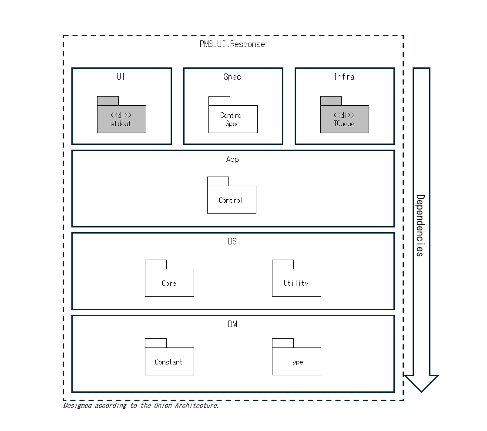

# pms-ui-response

`pms-ui-response` is one of the internal packages that make up the [`pty-mcp-server`](https://github.com/phoityne/pty-mcp-server) project.  
It is responsible for defining structured data types and utilities for formatting responses to be sent to the user interface layer.

In the context of a stdio-mode MCP server, this package specifically handles the construction and serialization of JSON-RPC response objects to be written to `stdout`.  
It acts as the final output stage, transforming typed results from the application layer into well-structured JSON responses.

---

## Package Structure

---

## Module Structure

---
